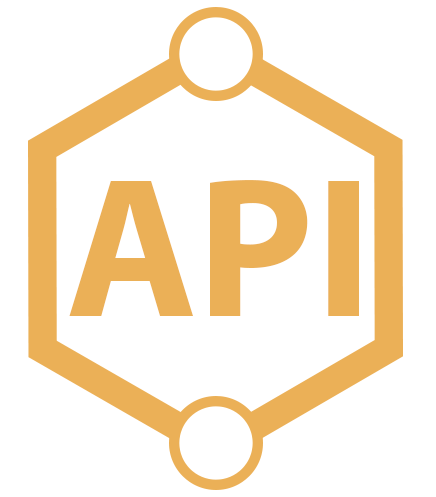
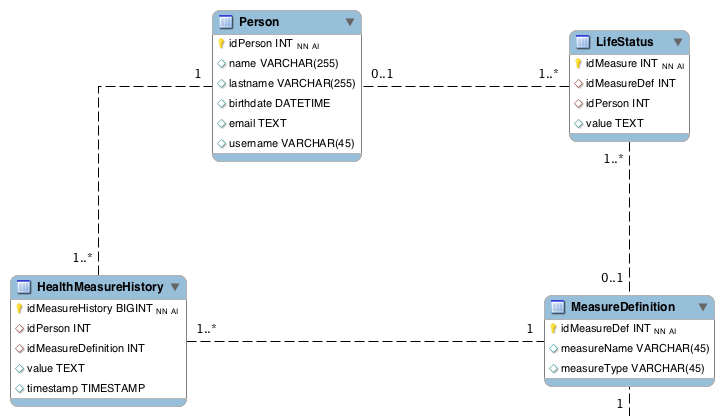

# Introsde 2015 Assignment 2 (Client and Server)

**Student:** Andrea Galloni ([Twitter](https://twitter.com/andreagalloni92))

**E-Mail:** andrea [dot] galloni [at] studenti [dot] unitn [dot] it

**Organization:** [UniTN](http://www.unitn.it/en)

**Course:** [Introduction to Service Design and Engineering](https://sites.google.com/site/introsdeunitn/)


<p align="center">
  
  
</p>

The project implements both a [REST](https://en.wikipedia.org/wiki/Representational_state_transfer) server and a client that is able to perform and test the server functionalities, the server can handle multiple body type formats: [JSON](https://en.wikipedia.org/wiki/JSON) and [XML](https://en.wikipedia.org/wiki/XML).  

The project is totally developed in [Java](https://en.wikipedia.org/wiki/Java_(programming_language)), making use of [Jersey](https://jersey.java.net/) RESTfull library, [JAXB](https://en.wikipedia.org/wiki/Java_Architecture_for_XML_Binding) **Java Architecture for XML Binding**, [Jackson](https://github.com/FasterXML/jackson) for JSON binding and [JPA](https://en.wikipedia.org/wiki/Java_Persistence_API) for the persistency.  


## Requirements:
`Apache Ant, OpenJDK, JRE and an Internet Connection;`

## Database and Models schemas:

<p align="center">
  
</p>

## Project Structure

The project is divided in the following packages:


#### Server Packages

`introsde.rest.ehealth.dao`: it contains the `LifeCoachDao` ([Data Access Object](https://en.wikipedia.org/wiki/Data_access_object)) class responsible of the data storing management, it provides an abstract interface to the database. ([link](https://github.com/sn1p3r46/introsde-2015-assignment-2/blob/master/Examples/src/introsde/rest/ehealth/dao/LifeCoachDao.java))

`introsde.rest.ehealth.model`: it contains the all classes describing our application models, their behavior, their methods, their ([JPA](https://en.wikipedia.org/wiki/Java_Persistence_API)) and their [JAXB](https://en.wikipedia.org/wiki/Java_Architecture_for_XML_Binding) annotations.   ([link](https://github.com/sn1p3r46/introsde-2015-assignment-2/tree/master/Examples/src/introsde/rest/ehealth/model))

`introsde.rest.ehealth.resources`: contains some classes that represents the service endpoints of our resources as [URIs](https://en.wikipedia.org/wiki/Uniform_Resource_Identifier). ([link](https://github.com/sn1p3r46/introsde-2015-assignment-2/tree/master/Examples/src/introsde/rest/ehealth/resources))

`introsde.rest.ehealth.test.model`: it contains two classes wrote to perform some Automatic [Unit Tests](https://en.wikipedia.org/wiki/Unit_testing) those classes are build on the [JUnit](https://en.wikipedia.org/wiki/JUnit) framework. ([link](https://github.com/sn1p3r46/introsde-2015-assignment-2/tree/master/Examples/src/introsde/rest/ehealth/test/model))

#### Client Packages

`introsde.rest.client.helpers`: it contains some helpful classes containing static string constants, classes that helps to print pretty ([JSON](https://en.wikipedia.org/wiki/JSON) and [XML](https://en.wikipedia.org/wiki/XML)) strings in the client console. ([link](https://github.com/sn1p3r46/introsde-2015-assignment-2/tree/master/Examples/src/introsde/rest/client/helpers))

`introsde.rest.client.models` and `introsde.rest.client.schemas`: those packages contain all classes describing our application models, their behavior, their methods and their [JAXB](https://en.wikipedia.org/wiki/Java_Architecture_for_XML_Binding) annotations. Models inside `schemas` are auto generated using the `xjc` tool, but sometimes I found those classes not working well during Marshalling ad Un-Marshalling due to the fact that I automatically generated also XSDs and those sometimes were not well generated, so I decided to drop this development approach but some of them are still used from the client application.     ([link](https://github.com/sn1p3r46/introsde-2015-assignment-2/tree/master/Examples/src/introsde/rest/client/schemas))


## Other Files and Folders:

The project contains some additional files and folders.

`client-xml.log` and `client-json.log`: contain logs generated from the client execution.

`build.xml`: this file ran by [Apache Ant](http://ant.apache.org/). It will download all the required dependencies using [Apache Ivy](http://ant.apache.org/ivy/). It will also download [Ivy](http://ant.apache.org/ivy/) if it is not installed.

`ivy.xml`: this file contains all libraries version and names that are needed to run the server those libraries will be downloaded by [Apache Ivy](http://ant.apache.org/ivy/).

`app.json` and `procfile`: files needed for the deployment on [Heroku](https://www.heroku.com/).


## Execution

To compile all the project:
```
ant compile
```
To execute the REST server enter:
```
ant start
```
To execute the client tests in [JSON](https://en.wikipedia.org/wiki/JSON):
```
ant client.testXML
```
To execute the client tests in [XML](https://en.wikipedia.org/wiki/XML):
```
ant client.testJSON
```


<p align="center">
  <br/><b><a href="https://atom.io/">Editor Used:</a></b><br/>
  <a href="https://atom.io/">
  
  </a>
</p>


## .


<p align="center">
  <a href="http://unitn.it/en">
  
  </a>
</p>
